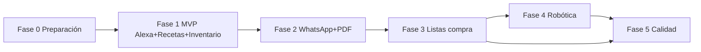

# Plan de trabajo: Sistema de Gestión Alimentaria por Voz (por flujos MVP)

Plan basado en [01-planning/brief/food_robot_architecture_brief.md](brief/food_robot_architecture_brief.md). Organizado por **flujos** con MVP primero: Alexa + recetas + inventario; el resto de flujos en fases posteriores.

---

## Fase 0: Preparación y entorno

- Definir repos y estructura de código (monorepo vs múltiples repos).
- Configurar entornos (dev/staging/prod), CI/CD básico y contenedores.
- Definir convenciones (Python 3.10+, FastAPI, tipos, tests).
- Configurar Supabase (proyecto, claves, políticas básicas).

**Entregables:** Repo inicial, Dockerfile(s), documentación de setup, acceso a Supabase.

---

## MVP – Fase 1: Flujo Alexa + recetas + inventario

Objetivo: el usuario puede **por voz (Alexa)** consultar recetas, gestionar inventario y obtener sugerencias de recetas según ingredientes disponibles. Respuesta <8 s (restricción del brief).

**Datos (solo lo necesario para este flujo):**
- Supabase PostgreSQL: tablas `recetas`, `ingredientes`, `ingredientes_por_receta`, inventario (y preferencias si aplica). Migraciones versionadas.
- Base vectorial (pgvector/Pinecone/Weaviate) para búsqueda semántica de recetas; embeddings precalculados para baja latencia.
- Capa de acceso a datos (repositorios/servicios) sobre Supabase y vector store.

**Servicio API de agentes (alcance MVP):**
- FastAPI con endpoints para recetas e inventario (ej. `/recipes`, `/recipes/suggest`, `/inventory`).
- Agente de recomendación de recetas: coincidencia con ingredientes disponibles (BD + retriever vectorial), ordenación, respuesta para voz.
- Lógica de inventario: consulta/actualización de ingredientes disponibles.
- Enrutado de intenciones hacia estos agentes; validación y observabilidad básica (logging, OpenTelemetry).

**Integración Alexa:**
- Skill Alexa + Adaptador AWS Lambda: voz → Lambda (validación, normalización) → API de agentes.
- Respuestas en <8 s: cache de consultas frecuentes, respuestas cortas, minimizar llamadas síncronas al LLM.

**Seguridad mínima:** Autenticación de la API (token/API key) y sanitización de entradas.

**Entregables:** Usuario puede hablar con Alexa para consultar recetas y obtener sugerencias según su inventario; latencia dentro de límite; datos y API desplegables.

---

## Fase 2: Flujo WhatsApp + PDF (ingesta de recetas)

Objetivo: ingestar PDF de recetas del nutricionista por WhatsApp; analizar, extraer y almacenar recetas e ingredientes; acuse de recibo <1 s y procesamiento en background.

**Pipeline RAG / ingesta:**
- Analizador PDF (extracción de texto).
- Fragmentador (chunks para búsqueda semántica), servicio de embeddings, almacenamiento en vector store.
- Agente de inventario: orquestar análisis PDF → extracción de recetas/ingredientes → normalización → persistencia en Supabase y actualización del índice vectorial.

**Integración WhatsApp:**
- Bot WhatsApp: recepción de PDF → acuse de recibo inmediato (<1 s) → cola o job en background para procesamiento.
- Notificación al usuario cuando el procesamiento termine (opcional).

**Entregables:** Usuario puede enviar PDF por WhatsApp; recetas se analizan y almacenan; RAG alimentado para consultas Alexa/Fase 1.

---

## Fase 3: Flujo listas de la compra

Objetivo: generación automática de listas de la compra a partir de recetas e inventario.

- Agente de lista de la compra: detección de ingredientes faltantes, agregación semanal, optimización (agrupación, unidades).
- Endpoints en la API de agentes (ej. `/shopping-list`); integración con Alexa (y/o WhatsApp) para solicitar y devolver la lista.

**Entregables:** Listas de la compra generadas automáticamente; accesibles por voz (y canal que se decida).

---

## Fase 4: Flujo robótica (opcional)

Objetivo: traducir receta seleccionada en acciones del robot (Raspberry Pi).

- Servicio en Raspberry Pi: recepción de comandos (MQTT o WebSocket), ejecución de acciones, opcionalmente estado.
- Agente de comandos robóticos: pasos de receta → secuencia de acciones → envío al controlador; aislamiento de red (brief §10).
- Pruebas en entorno simulado o hardware.

**Entregables:** Demostración receta → acciones en Raspberry Pi; documentación de despliegue y seguridad.

---

## Fase 5: Calidad y definición de hecho

- Tests: cobertura unitaria ≥90%; pruebas de integración (API, BD, vector store, flujos Alexa, WhatsApp, listas).
- Revisión de código; diagramas C4 actualizados.
- DoD del brief (§12): checklist por flujo (PDF por WhatsApp; consultas Alexa; coincidencia ingredientes; listas automáticas; opcional robot).

**Entregables:** Suite de tests en verde, DoD cumplido, diagramas en repo.

---

## Orden y dependencias por flujos

- **MVP (Fase 1)** entrega el flujo completo voz + recetas + inventario.
- **Fase 2** añade el flujo de ingesta por WhatsApp y alimenta el conocimiento (RAG) usado en MVP.
- **Fase 3** añade el flujo de listas de la compra.
- **Fase 4** es opcional y puede omitirse o dejarse para después del DoD mínimo.
- **Fase 5** se aplica de forma continua o al cierre de cada flujo según criterio del equipo.

---

## Preguntas para seguir iterando (1 a 1)

1. **RAG en MVP:** ¿En Fase 1 las recetas se cargan solo manualmente/seed o ya habrá una forma mínima de ingesta (ej. CSV/JSON) para tener datos?
2. **Robótica:** ¿Fase 4 dentro del primer release o siempre post-MVP?
3. **Multi-usuario:** ¿Un único hogar/usuario o multi-tenant desde el inicio?
4. **LLM/Embeddings:** ¿Cloud (OpenAI, etc.) o preferencia por modelos locales?

Indica la siguiente pregunta o cambio que quieras y ajustamos el plan.
